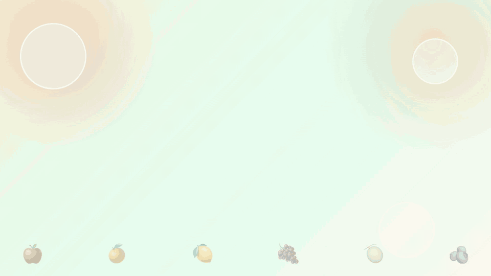

# Juice Chain Drop

果物を落として、消して、ジュースを作る落ち物パズルゲームです。

公開URL: https://sakataka.github.io/juice-chain-drop/

## 紹介動画



## ゲーム概要

`Juice Chain Drop` は、2つ1組で落ちてくる果物を並べ、同じ果物を4個以上つなげて消すパズルゲームです。消した果物でジュースボトルが完成すると、そのボトル自身が `Next Drop` に入り、1マスの落下ピースとして盤面へ戻ってきます。

ゲームの核は `CHAIN → PRESS → JUICE DROP → CHAIN` です。連鎖で果汁をため、ボトルを狙った位置へ落とし、着弾時のジュース効果で盤面を崩して次の連鎖を作ります。

通常プレイのほか、難易度プリセット、チャレンジモード、タッチ操作、BGM/SFX音量調整、連鎖・プレス・着弾の強調演出、ローカル保存のプレイ記録に対応しています。

## ルール

- 盤面は `6列 x 12行` です。
- 果物は `Apple`, `Orange`, `Lemon`, `Grape`, `Melon`, `Berry` の6種類です。
- 落下する果物ペアを移動・回転させて盤面に積みます。
- 同じ果物が直交方向に4個以上つながると消えます。
- 消去後は重力で果物が落ち、さらに4個以上つながると連鎖します。
- 盤面上部に新しい果物ペアを置けなくなるとゲームオーバーです。
- 即落下中は1マスごとに少しスコアが加算されます。
- 消去スコアは、消えた数、連鎖倍率、ジュース効果の倍率で決まります。
- `Press Tank` は果物ごとの搾汁進捗を表示します。必要数に達するとボトルが1本完成します。
- 完成したボトルは `Next Drop` に入り、次の果物ペアを置いたあとに落下ピースになります。
- ボトルは1マスで落下し、左右移動と落下位置の調整ができます。着地すると割れて果汁が広がり、果物ごとの効果を発動します。
- `Next Drop` には、これから落ちる果物ペアとジュースボトルが3手先まで表示されます。
- 最高スコア、最高連鎖、プレイ回数、最終プレイ日時はブラウザの `localStorage` に保存されます。

## 難易度

設定パネルから `Easy`, `Normal`, `Hard` を選べます。初期値は `Normal` です。

| 難易度 | 通常落下 | 低速化中 | スコア倍率 | ジュース獲得 |
| --- | ---: | ---: | ---: | --- |
| Easy | 760ms | 1040ms | 0.9x | 3個消すごと |
| Normal | 620ms | 880ms | 1.0x | 4個消すごと |
| Hard | 500ms | 720ms | 1.25x | 5個消すごと |

## モード

設定パネルから次のモードを選べます。

| モード | 目標 |
| --- | --- |
| Normal | 通常のエンドレスプレイ |
| Score Attack | 5万点到達までのタイムを競う |
| Chain Challenge | 60秒以内の最大連鎖を競う |
| Water Cleanup | 最初に出現する水30個を全消去するまでのタイムを競う |

モードごとの進捗と結果はサイドパネルの `Challenge` に表示されます。

## 操作方法

| キー | 操作 |
| --- | --- |
| `ArrowLeft` | 左へ移動 |
| `ArrowRight` | 右へ移動 |
| `ArrowDown` | 高速落下 |
| `ArrowUp` | 回転 |
| `Space` | 即落下 |
| `Enter` | Start / Restart |
| `P` / `Escape` | Pause / Resume |
盤面下のタッチ操作ボタンから、左右移動、回転、高速落下、即落下、ポーズ/再開も実行できます。ジュースボトルは通常のピースと同じ操作で落下位置を決めます。ボトルは1マスピースのため回転しません。

## 設定

設定パネルでは次を変更できます。設定値はブラウザの `localStorage` に保存されます。

- 難易度
- モード
- 演出軽減
- SFX音量
- BGM音量
- 操作説明の確認

サウンドは `Sound On / Sound Off` で切り替えます。BGMはブラウザの自動再生制限に合わせ、サウンド有効後のユーザー操作をきっかけに開始します。

## Juice Drop

果物を一定数消すごとに、その果物のボトルが1本完成します。必要数は難易度によって変わります。完成したボトルは手動で選ぶアイテムではなく、`Next Drop` の落下順へ自動で組み込まれます。

| ジュース | 効果 |
| --- | --- |
| Apple Juice | 中心周囲 `3 x 3` の果物を消す |
| Orange Juice | 中心行の果物を消す |
| Lemon Juice | 中心周辺の最大4個を現在の軸果物に変える |
| Grape Juice | 中心列の果物を消す |
| Melon Juice | 着地点を中心にひし形範囲を消し、次の1手を遅くして消去スコアを `1.5x` にする |
| Berry Juice | 盤面で最も多い果物に、中心周辺の最大5個を変える |

ジュース効果の中心はボトルの着地点です。盤面が高く積み上がっている時は、ボトルを上部で割って切り返すこともできます。

着弾時には、効果で変化したセル数やジュースの種類に応じたボーナスも入ります。効果によって4個以上がつながれば、そのまま通常の連鎖と次のプレスへつながります。

## 演出

連鎖、ボトル完成、Juice Dropの着弾、ゲーム進行段階の変化には、盤面上の光、波紋、スプラッシュ、スコア表示、SFX/BGMの変化が入ります。

- 2連鎖以上ではチェーン数が盤面中央に表示され、3連鎖以上ではより大きなスプラッシュとコンボ演出が入ります。
- ボトルが完成すると `Press Tank` が `NEXT` 表示になり、`Next Drop` にボトルが現れます。
- ボトル着弾時は効果中心から果汁の波紋と粒子が広がり、対象セルが少ない場合でも使用したことが分かる演出が入ります。
- プレイ時間による進行段階が上がるとBGMテンポが変わり、盤面外周に `SPEED UP` のパルスが出ます。

設定の `演出軽減` を有効にすると、これらの視覚演出は抑制されます。

## 水

水は `Water Cleanup` 専用の障害物です。同じ水同士では消えず、隣接する果物グループを消した時や、破壊系のJuice Dropに巻き込んで消せます。開始時に水が30個出現し、追加の定期水落下は発生しません。すべて消すまでのタイムを競います。

## 技術構成

- Vite
- TypeScript
- PixiJS
- JSFXR
- Tone.js
- midi-writer-js
- Vitest
- Playwright
- GitHub Pages

## 開発

依存関係のインストール:

```bash
bun install
```

BGM MIDIの生成:

```bash
bun run generate:bgm
```

ローカル開発サーバー:

```bash
bun run dev
```

本番ビルド:

```bash
bun run build
```

ビルド成果物の確認:

```bash
bun run preview
```

単体テスト:

```bash
bun run test
```

カバレッジ確認:

```bash
bun run test:coverage
```

E2Eテスト:

```bash
bun run test:e2e
```

## デプロイ

`main` ブランチにpushすると、GitHub Actionsでビルドされ、GitHub Pagesにデプロイされます。
